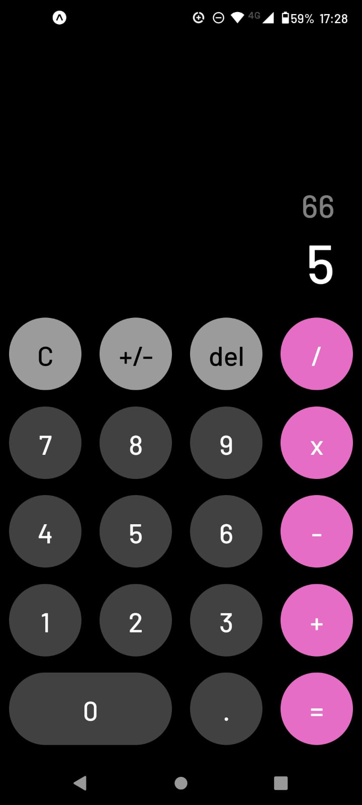

# Hero-App


 
 
## Tecnologías utilizadas:

* __Javascript__
* __React Native__
* __Hooks__
* __Custom Hooks__


## Antes de empezar
Es necesario tener, al menos, la última versión estable de Node y NPM. Asegurese de tenerlas para instalar correctamente las dependencias necesarias para correr el proyecto.

Las versiones requeridas son:
- **Node**: 14.20 o superior
- **NPM**: 6.14 o superior

Para chequear que versiones tiene instaladas:
> node -v
> npm -v

## Instrucciones para correr el servidor de desarrollo

1. Clonar el repositorio
2. Correr los siguientes comandos:
```
npm install
npx expo start
```

## Descripción
Calculadora

## Funcionalidades:
-Funciones aritméticas como sumar, restar, multiplicar y dividir tanto numeros enteros como decimales


